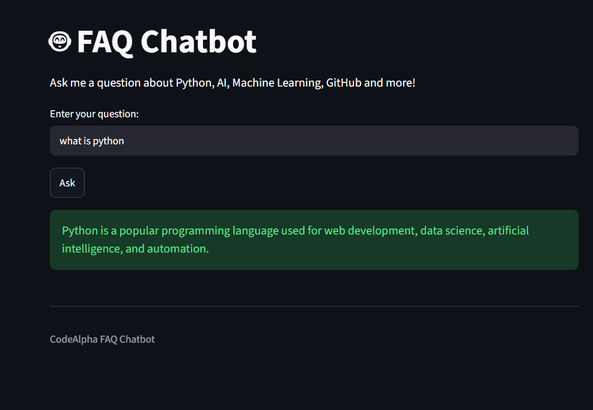

# CodeAlpha FAQ Chatbot

A simple FAQ Chatbot built using Python and Streamlit.

## Features

- Answers frequently asked questions
- Uses text preprocessing
- Uses TF-IDF Vectorization
- Finds the best matching question
- Simple and user-friendly interface

## Technologies Used

- Python
- Streamlit
- Scikit-learn
- TF-IDF Vectorizer

## Sample Questions

- What is CodeAlpha?
- How can I apply for an internship?
- What tasks are required in the internship?
- How do I submit my completed task?
- What is GitHub?
- What is Python?
- What is Artificial Intelligence?
- What is Machine Learning?

## How to Run

```bash
pip install -r requirements.txt
python -m streamlit run app.py
 
**## Screenshot**
